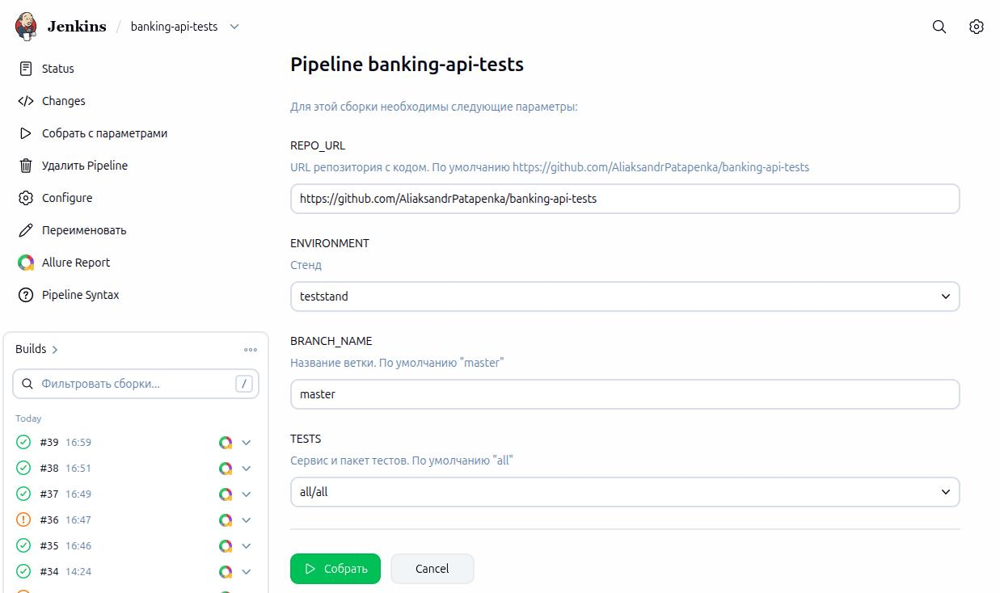
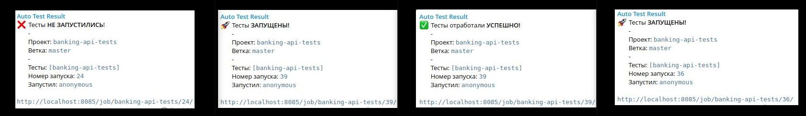
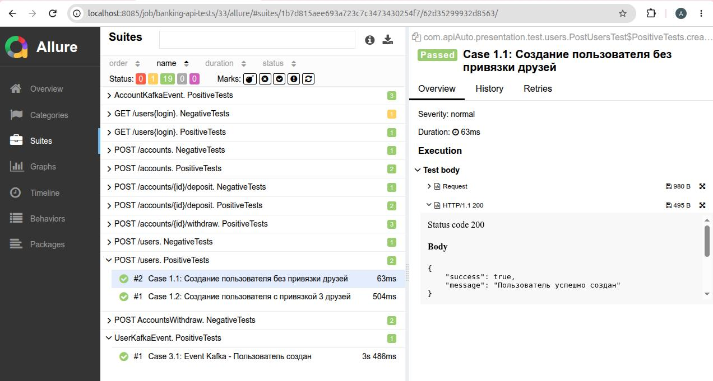
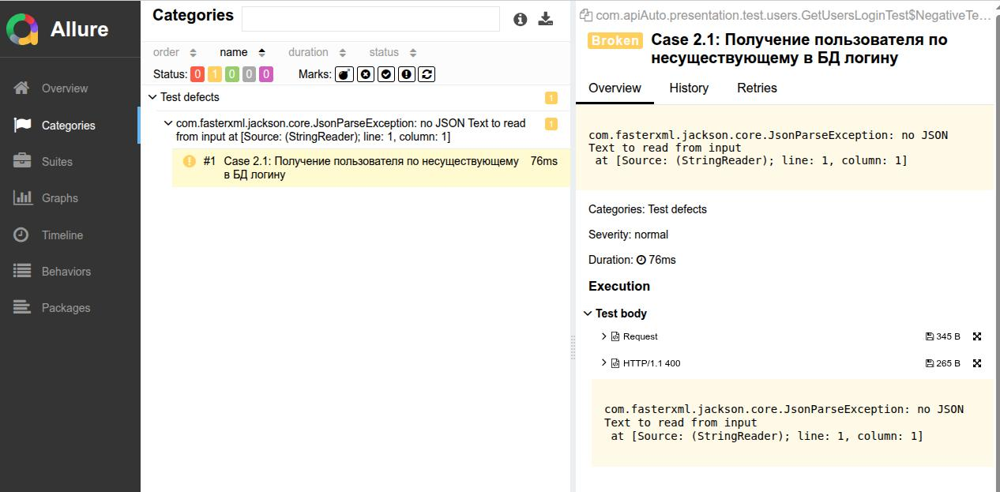

# Фреймворк для API тестирования (RestAssured + JUnit 5) с Telegram-уведомлениями

Автоматизированные тесты для REST API банковского сервиса с использованием **RestAssured**, **JUnit 5**, **Allure
Reports** и интеграцией с **Jenkins**. Реализованы генерация тестовых данных, валидация JSON Schema, проверка данных в
**PostgreSQL**, проверка **Kafka**-событий и отправка уведомлений в Telegram о результатах сборки.

Инфраструктура поднимается через **Docker Compose**: PostgreSQL, Zookeeper, Kafka,
Jenkins и тестируемое приложение presentation.

---

## Используемые технологии

| Технология                | Версия |
|:--------------------------|:-------|
| **Java**                  | 17     | 
| **RestAssured**           | 5.3.0  |
| **JUnit 5**               | 5.10.0 |
| **Jackson**               | 2.15.2 |
| **JSON Schema Validator** | 5.3.0  |
| **Allure Framework**      | 2.25.0 |
| **PostgreSQL (JDBC)**     | 42.7.3 |
| **Kafka Clients**         | 3.5.1  |
| **Maven**                 | 3.x    |
| **Docker Compose**        | -      |
| **Jenkins**               | -      |

---

## Структура проекта

```
src/test/java/com/apiAuto/
├── common/                      # Общие настройки и утилиты
│   ├── config/                  # Конфигурация
│   ├── constants/               # Общие константы
│   └── helpers/                 # Вспомогательные классы
│
└── presentation/                # Слой тестирования банковского API (сервис Presentation)
    ├── config/                  # Конфигурация сервиса presentation
    │
    ├── constants/
    │   ├── endpoints/           # Endpoints
    │   ├── kafka/               # Kafka-константы (TopicKafka, UserKafkaConst, AccountKafkaConst)
    │   ├── queryParam/          # Query-параметры (UserQueryParam, AccountQueryParam)
    │   ├── schemasPatchs/       # Пути к JSON Schema
    │   ├── sql/                 # SQL-запросы
    │   └── testData/            # Тестовые данные
    │
    ├── dto/                     # POJO-модели для запросов
    │
    ├── helpers/                 # Вспомогательные классы
    │   ├── accountHelper/       # Помощники для счетов (AccountSteps, AccountTemplate, AccountDb)
    │   ├── testHelper/          # Генерация данных, очистка БД
    │   └── userHelper/          # Шаблоны и работа с БД для пользователей
    │
    └── test/                    # Тест-классы
        ├── accounts/            # Тесты для блока accounts (создание, пополнение, списание)
        ├── kafka/               # Тесты Kafka-событий (UserKafkaTest, AccountKafkaTest)
        └── users/               # Тесты для блока users (создание, получение по логину)

src/test/resources/
├── config/                      # Конфигурация стенда/окружения (по профилям)
│   ├── local/                   # Локальный запуск
│   └── teststand/               # Стенд teststand
├── schemas/                     # JSON Schema для валидации ответов
│   ├── errorSchema/             # Схемы для ошибок (400)
│   └── presentation/
│       ├── accountSchema/       # Схемы для счетов
│       └── userSchema/          # Схемы для пользователей
├── allure.properties            # Настройки Allure
└── junit-platform.properties    # Настройки запуска JUnit
```

## Команды для запуска

**Локальный запуск всех тестов (по умолчанию `service=presentation`, `profile=local`) и генерация Allure-отчета:**

```
mvn clean test; allure generate target/allure-results --clean -o allure-report; allure open allure-report

```

**Запуск тестов на стенде (с указанием сервиса, профиля и пароля БД):**

```
mvn clean test -Dservice=presentation -Dprofile=teststand -Ddb.password=<пароль>

```

**Запуск отдельного пакета тестов:**

```
mvn clean test -Dtest=accounts/*    # только тесты счетов
mvn clean test -Dtest=users/*       # только тесты пользователей
mvn clean test -Dtest=kafka/*       # только тесты Kafka-событий

```

### Локальное окружение (Docker Compose)

Поднимает инфраструктуру для тестирования: **PostgreSQL** (порт 54321), **Zookeeper** (2181), **Kafka** (9092),
**Jenkins** (8085) и тестируемое приложение **presentation** (8081):

```
docker compose up -d

```

### Параллельный запуск тестов

В проекте настроен параллельный запуск тестов для ускорения выполнения:

- **JUnit уровень** — `junit-platform.properties`
- **Maven уровень** — `maven-surefire-plugin` (`parallel=methods`, `threadCount=4`)

---

## CI/CD (Jenkins)

Проект интегрирован с Jenkins. Пайплайн через Jenkinsfile поддерживает параметризированную сборку:

**Параметры сборки:**

- `REPO_URL` — ссылка на тестируемый репозиторий
- `ENVIRONMENT` — стенд (окружение), на котором запускаются тесты
- `BRANCH_NAME` — ветка тестируемого репозитория
- `TESTS` — сервис и пакет тестов в формате `<сервис>/<пакет>`:
  - `all/all` — все тесты всех сервисов
  - `presentation/all` — все тесты сервиса presentation
  - `presentation/accounts`, `presentation/users`, `presentation/kafka` — отдельные пакеты тестов

**Страница запуска сборки в Jenkins:**



---

## Telegram-уведомления

Jenkins-пайплайн отправляет уведомления в Telegram о статусе сборки:

- 🚀 Тесты **ЗАПУШЕНЫ!**
- ✅ Тесты отработали **УСПЕШНО!**
- ⚠️ Тесты **УПАЛИ!**
- ❌ Тесты **НЕ ЗАПУСТИЛИСЬ!**

**Пример уведомлений в Telegram:**

---

## Allure-отчетность

После выполнения тестов генерируется детальный Allure-отчет, который публикуется в Jenkins.

**Пример отчета (Тест пройден успешно):**


Пример отчета (Тест упал):


---

# Чеклист покрытия тестами API

## Позитивные тесты

| № метода | № кейса | Метод                                                 | Название теста                                              | Статус код |
|----------|---------|-------------------------------------------------------|-------------------------------------------------------------|------------|
| 1        |         | POST /users — Создание пользователя                   |                                                             |            |
|          | Case1.1 | POST /users                                           | Создание пользователя без привязки друзей                   | 200        |
|          | Case1.2 | POST /users                                           | Создание пользователя с привязкой 3 друзей                  | 200        |
| 2        |         | GET /users/{login} — Получение пользователя по логину |                                                             |            |
|          | Case2.1 | GET /users/{login}                                    | Получение пользователя по существующему в БД логину         | 200        |
| 3        |         | POST /accounts — Создание счёта                       |                                                             |            |
|          | Case3.1 | POST /accounts                                        | Создание счёта у пользователя, у которого отсутствуют счета | 200        |
|          | Case3.2 | POST /accounts                                        | Создание счёта у пользователя, у которого уже есть счёт     | 200        |
| 4        |         | POST /accounts/{id}/deposit — Пополнение счёта        |                                                             |            |
|          | Case4.1 | POST /accounts/{id}/deposit                           | Пополнение счёта (max значение)                             | 200        |
|          | Case4.2 | POST /accounts/{id}/deposit                           | Пополнение счёта (min значение)                             | 200        |
| 5        |         | POST /accounts/{id}/withdraw — Списание со счёта      |                                                             |            |
|          | Case5.1 | POST /accounts/{id}/withdraw                          | Списание части баланса со счёта при достаточном балансе     | 200        |
|          | Case5.2 | POST /accounts/{id}/withdraw                          | Списание всего баланса со счёта при достаточном балансе     | 200        |
|          | Case5.3 | POST /accounts/{id}/withdraw                          | Списание со счёта нулевого значения (баланс ненулевой)      | 200        |

## Негативные тесты

| № метода | № кейса | Метод                                                 | Название теста                                             | Статус код |
|----------|---------|-------------------------------------------------------|------------------------------------------------------------|------------|
| 1        |         | POST /users — Создание пользователя                   |                                                            |            |
|          | Case1.2 | POST /users                                           | Создание пользователя с существующим в базе данных логином | 400        |
| 2        |         | GET /users/{login} — Получение пользователя по логину |                                                            |            |
|          | Case2.1 | GET /users/{login}                                    | Получение пользователя по несуществующему в БД логину      | 400        |
| 3        |         | POST /accounts — Создание счёта                       |                                                            |            |
|          | Case3.1 | POST /accounts                                        | Создание счёта для несуществующего пользователя            | 400        |
| 4        |         | POST /accounts/{id}/deposit — Пополнение счёта        |                                                            |            |
|          | Case4.1 | POST /accounts/{id}/deposit                           | Пополнение счёта (отрицательное значение)                  | 400        |
| 5        |         | POST /accounts/{id}/withdraw — Списание со счёта      |                                                            |            |
|          | Case5.1 | POST /accounts/{id}/withdraw                          | Списание суммы, превышающей текущий баланс (не нулевой)    | 400        |
|          | Case5.2 | POST /accounts/{id}/withdraw                          | Списание со счёта при нулевом балансе                      | 400        |

## Kafka-события

| № топика | № кейса | Топик                | Название теста                     | Статус код |
|----------|---------|----------------------|------------------------------------|------------|
| 1        |         | user-events          |                                    |            |
|          | Case3.1 | user-events          | Event Kafka — Пользователь создан  | 200        |
| 2        |         | account-events       |                                    |            |
|          | Case6.1 | account-events       | Event Kafka — Создание счёта       | 200        |
|          | Case6.2 | account-events       | Event Kafka — Пополнение счёта     | 200        |
|          | Case6.3 | account-events       | Event Kafka — Снятие со счёта      | 200        |

---

## Лицензия

Этот проект является демонстрационным и не имеет лицензии. Используйте на свой страх и риск:)
